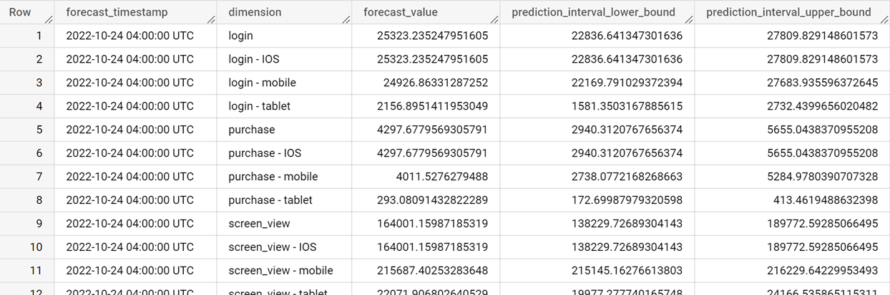

# Desjardins - Détection d'anomalies Google Analytics 4 avec BigQuery ML (ARIMA+) de façon automatique


*Présentation pour le DAMM de Novembre 2022 par Sébastien Brodeur de Desjardins.*

---

Il est possible d'utiliser [BigQuery ML et un modèle prédictif ARIMA+](https://cloud.google.com/bigquery-ml/docs/reference/standard-sql/bigqueryml-syntax-create-time-series) afin d'effectuer des prédictions sur des séries temporelles.

Ensuite, en comparant cette prédiction avec les valeurs réels, il est possible d'identifier des anomalies potentielles.


Je vais donc démontrer une méthode simple d'effectuer une détection d'anomalies sur les données de Google Analytics 4 (GA4) exportés vers BigQuery un utilisant simplement quelques requêtes *SQL*.  Oui oui, juste avec du SQL.

Voici les grandes lignes : 


---

# Préparer vos données brutes pour effectuer la détection d'anomalie

Comme tout projet de ML, l'étape la plus importante (et parfois le plus fastidieuse) est de préparer les données.  Cette étape est pourtant la plus importante.  Voici comment préparer vos données afin d'être prêt à être consommé par BigQuey ML pour effectuer des prédictions.

La table devra avoir le format suivant :

| ts | dimension | value |
|-----------|-----------|-------------|
| 2022-10-27 04:00:00 UTC          | login          | 100            |
| 2022-10-28 04:00:00 UTC          | login          | 130            |
| 2022-10-28 04:00:00 UTC          | unique_user          | 90            |
| ...          | ...          | ...           |

_Ne vous inquiété pas, nous allons expliquer ces colonnes plus bas._

L'avantage de cette approche, est que si vous désirez surveiller une nouvelle dimension/métrique, vous n'avez rien d'autre à faire que de modifier la requête qui génère cette table.

---

# Voici des exemples de requêtes pour créer une table de ce genre à partir des données de GA4

Nous allons d'abord créer une table avec les valeurs (dimensions/values) que nous souhaitons surveiller.  

*(Remplacer dans la requête **PROJET** et **DATASET** par les vôtre.)*

```sql
CREATE OR REPLACE TABLE `PROJET.DATASET.detection_anomalies_data` AS (
  # Requête pour surveiller le nombre event par jour pour certain event GA4.
  SELECT
    PARSE_TIMESTAMP("%Y%m%d", event_date, "America/Montreal") AS ts, 
    event_name AS dimension, 
    COUNT(*) AS value
  FROM `PROJET.DATASET.events_*`
  WHERE
    _TABLE_SUFFIX >= FORMAT_DATE("%Y%m%d", DATE_SUB(CURRENT_DATE(), INTERVAL 120 DAY))
    AND event_name IN ("screen_view", "search", "login", "purchase")
  GROUP BY ts, dimension

  UNION ALL

  # Requête pour surveiller le nombre event par jour et par plateforme pour certain event GA4.
  SELECT
    PARSE_TIMESTAMP("%Y%m%d", event_date, "America/Montreal") AS ts,
    CONCAT(event_name, " - ", platform) AS dimension,
    COUNT(*) AS value
  FROM `PROJET.DATASET.events_*`
  WHERE 
    _TABLE_SUFFIX >= FORMAT_DATE("%Y%m%d", DATE_SUB(CURRENT_DATE(), INTERVAL 120 DAY))
    AND event_name IN ("screen_view", "search", "login", "purchase")
  GROUP BY ts, dimension

  UNION ALL

  # Requête pour surveiller le nombre event par jour et par type appareil pour certain event GA4.
  SELECT
    PARSE_TIMESTAMP("%Y%m%d", event_date, "America/Montreal") AS ts,
    CONCAT(event_name, " - ", device.category) AS dimension,
    COUNT(*) AS value
  FROM `PROJET.DATASET.events_*`
  WHERE
    _TABLE_SUFFIX >= FORMAT_DATE("%Y%m%d", DATE_SUB(CURRENT_DATE(), INTERVAL 120 DAY))
    AND event_name IN ("screen_view", "search", "login", "purchase")
  GROUP BY ts, dimension

  UNION ALL

  # Requête pour surveiller le nombre unique de visiteur (user_pseudo_id).
  SELECT
    PARSE_TIMESTAMP("%Y%m%d", event_date, "America/Montreal") AS ts,
    "unique_user" AS dimension,
    COUNT(DISTINCT user_pseudo_id) AS value
  FROM `PROJET.DATASET.events_*`
  WHERE
    _TABLE_SUFFIX >= FORMAT_DATE("%Y%m%d", DATE_SUB(CURRENT_DATE(), INTERVAL 120 DAY))
  GROUP BY ts, dimension
)
```

Ces 4 requêtes peuvent faire peur si vous n'êtes pas habitué à BigQuery, mais nous allons prendre le temps de les décortiquer.  ([Cliquer ici pour en savoir plus sur le schémas de données GA4 dans BigQuery.](https://support.google.com/analytics/answer/7029846?hl=en))


## **ts**

Pour fonctionner, le modèle ARIMA+ de BigQueryML s'attends à recevoir une colonnes contenant un champs de type `TIMESTAMP`. Comme nous allons effectuer une prédiction sur un total par jour, le champ `event_date` (STRING) de GA4 doit être convertis TIMESTAMP.  C'est ce que nous faison ici : `PARSE_TIMESTAMP("%Y%m%d", event_date, "America/Montreal") AS ts`.

## **dimension et value**

C'est ici que nous ajoutons ce que nous souhaitons surveiller.  Il est possible d'utiliser `UNION ALL` afin de combiner plusieurs requêtes ensembles.  Dans l'exemple ci-haut, je crée dynamiquement plusieurs dimensions en combinant plusieurs champs de la table GA4.

1. **event_name** - Avoir un décompte du nombre de fois que chaque event c'est produit (`COUNT(*) AS value`).  Ici, afin de limiter le nombres de dimensions, j'utilise une condition dans la requête afin de sélectionner certains event_name seulement (`WHERE event_name IN ("screen_view", "search", "login", "purchase")`)
2. **event_name - _PLATFORM_** - Ici je combine le event_name avec la platform (IOS, ANDROID, WEB) afin d'être en mesure de détecter un problème spécifique sur une plateform précise.  Par exemple, nous avons peut-être uniquement un problème sur IOS mais pas ANDROID.  J'effectue la combinaison de 2 champs BigQuery avec un `CONCAT(event_name, " - ", platform)`.
3. **event_name - _DEVICE CATEGORY_** - Ici je combine le event_name avec la platform (DESKTOP, MOBILE, TABLET) afin d'être en mesure de détecter un problème spécifique sur un type d'appareil.  Par exemple, nous avons peut-être uniquement un problème sur le mobile.  J'effectue la combinaison de 2 champs BigQuery avec un `CONCAT(event_name, " - ", device.category)`.
4. **unique_user** - Ici je fais les choses différement.  Je veux regarder si le nombre de user (`COUNT(DISTINCT user_pseudo_id)`) à diminuer.  Je ne regarde donc pas pour des event_name spécifiques, c'est pourquoi j'ai retiré la condition dans le `WHERE`.

## À quoi sert le `_TABLE_SUFFIX >= FORMAT_DATE("%Y%m%d",DATE_SUB(CURRENT_DATE(), INTERVAL 120 DAY))`?

Afin d'effectuer une prédiction précise, nous avons besoin d'un certain volume d'historique.  Si l'historique est trop grand, ça va nuire au modèle (les données AVANT la pandémie n'ont probablement plus rien à voir avec celles d'aujour'hui.)  Mais prendre une période trop petite ne nous permetteras pas de détecter des tendances lourdes ou certaines saisonalité.  C'est pourquoi je prends ici les 120 derniers jours.

Google sépare les données exportés de GA4 dans une table par jour.  Donc, si nous voulons effectuer une requête sur plus d'une journée, nous devons utiliser un *widlcard* dans le nom de la table.  C'est pourquoi au lieu de préciser la table exacte dans la requête (event_20220125), nous utilions event_\*. Nous limitons ensuite via une condition `WHERE` les jours que nous voulons utiliser en utilisant `_TABLE_SUFFIX`.

Voilà, notre matière première est prête pour être utiliser par BigQuery ML.  Le pire est fait, je vous le jure.

---

# Entraîner un modèle de prédiction ARIMA+ afin de détecter des anomalies

Nous allons utiliser les données des derniers jours afin d'effectuer une prédiction pour nos valeurs.  C'est pourquoi nous n'allons pas utiliser les 7 derniers jours pour entraîner notre modèle.  Ensuite, en comparant les valeurs réelles des 7 derniers jours avec la prédiction de ces même jours, nous serons en mesure d'identifier des écarts entre la réalité et la prédiction.  Ces écarts devrons ensuite être analyser afin de déterminer si ce sont de faux-positif ou de vraies anomalies que nous devons corriger.

BigQuery ML est très puissants et permet de créer des modèles complexes avec une facilité déconcertante.  Nous avons simplement besoin d'une requête SQL : 

```sql
CREATE OR REPLACE MODEL `PROJET.DATASET.detection_anomalies_model`
 OPTIONS(MODEL_TYPE='ARIMA_PLUS', 
  AUTO_ARIMA = TRUE, # Nécessaire pour une prédiction multiples.
  DATA_FREQUENCY = 'AUTO_FREQUENCY',
  HOLIDAY_REGION = "CA", # Inclure les jours fériés canadiens dans le modèle.
  time_series_timestamp_col='ts',
  time_series_data_col='value',
  time_series_id_col='dimension',
  horizon = 7) AS
SELECT
  *
FROM
  `PROJET.DATASET.detection_anomalies_data`
WHERE
  ts < TIMESTAMP_SUB(TIMESTAMP_SUB(CURRENT_TIMESTAMP(), INTERVAL 1 DAY), INTERVAL 7 DAY) # Important, exclure les 7 derniers jours pour entrainer nos modèles.
```

C'est tout.  Oui, oui je vous jure.  Le modèle est entrainer.  En fait LES modèles devrais-je dire, car BigQuery ML a entraîner autant de modèle que nous avions de dimensions distingue dans la colonne dimension.

# Comprendre cette requête BigQuery ML

- **MODEL_TYPE = ARIMA_PLUS** - Indiquer que nous désirons créer un modèle ARIMA+.  Ce type de modèles est fait pour l'analyse des séries temporelles.  Avec BigQueryML il est possible de créer plusieurs [autres type de modèles](https://cloud.google.com/bigquery-ml/docs/reference/standard-sql/bigqueryml-syntax-e2e-journey).
- **AUTO_ARIMA = TRUE** - Mettre à TRUE car nous avons entraîner PLUSIEURS modèles.
- **DATA_FREQUENCY = AUTO_FREQUENCEY** - Détecter la fréquence de notre série temporelle. (Est-ce des valeurs par heures/jour/mois?)
- **HOLIDAY_REGION = CA** - Indiquer de prendre en compte les jours fériés Canadien dans le modèle.
- **time_series_timestamp_col = 'ts'** - Indiquer quel champs contient le timestamp.
- **time_series_data_col = 'dimension'** - Indiquer quel champs contient la valeur que nous souhaitons prédire.
- **time_series_id_col = 'value'** - Indiquer que le champs dimension contient le nom de la dimension que nous soyons prédire.
- **horizon = 7** - Indiquer que nous voulons faire une prédiction sur un horizon de 7 jours.

[*Pour en savoir plus sur le modèle ARIMA+*](https://cloud.google.com/bigquery-ml/docs/reference/standard-sql/bigqueryml-syntax-e2e-journey)

---

# Effectuer une prédiction avec le modèle

Maintenant que nous avons entraîner nos modèles, nous désirons effectuer une prédiction pour les 7 prochains jours avec un intervale de confiance de 95%.  Encore une fois, c'est aussi simple que d'exécuter cette requête : 

```sql
SELECT
  forecast_timestamp, dimension, forecast_value, prediction_interval_lower_bound, prediction_interval_upper_bound
FROM
  ML.FORECAST(MODEL `PROJET.DATASET.detection_anomalies_model`, STRUCT(7 AS horizon, 0.95 AS confidence_level))
```

Voici de quoi ressemble une prédiction : 



Il ne reste ensuite qu'à comparer ces prédictions avec la réalité.  Il est même possible de le faire en effectuant une jointure entre la table de prédiction et la table des valeurs réelles :

```sql
 WITH 
   prediction AS (
    SELECT
      forecast_timestamp, dimension, forecast_value, prediction_interval_lower_bound, prediction_interval_upper_bound
    FROM
      ML.FORECAST(MODEL `PROJET.DATASET.detection_anomalies_model`, STRUCT(7 AS horizon, 0.95 AS confidence_level))
   ),
   reel as (
     SELECT
      *
    FROM
      `PROJET.DATASET.detection_anomalies_data`
    WHERE
      ts >= TIMESTAMP_SUB(TIMESTAMP_SUB(CURRENT_TIMESTAMP(), INTERVAL 1 DAY), INTERVAL 7 DAY) # Inclure seulement les 7 derniers jours pour évaluer nos modèles.
   )
  
 SELECT
  prediction.*,
  reel.value,
  IF (reel.value > prediction_interval_upper_bound OR reel.value < prediction_interval_lower_bound, "Anomalie", "Normal") AS anomalie
FROM prediction INNER JOIN reel
ON
  prediction.forecast_timestamp = reel.ts
  AND prediction.dimension = reel.dimension
```


Finalement, il est même possible d'utiliser Lokker Studio afin d'inspecter les données.


Évidement, ici les données sont bidons, mais ça vous montre quand même l'idée.

---

# Et l'automatisation dans tous ça?  Le titre dit bien "de façon automatique"

Il est possible [d'automatiser directement l'exécution d'une requête depuis la console web BigQuery](https://cloud.google.com/bigquery/docs/scheduling-queries).  Il est donc possible d'automatiser nos 3 requêtes, mais attention de le faire dans le bon ordre.  Par exemple, chaque dimanche : 

1. Préparation des données à 18h00.
2. Entraînement des modèles à 18h10.
3. Comparer les prédictions et les valeurs réel à 18h20.


Ce n'est pas plus compliqué que ça.
